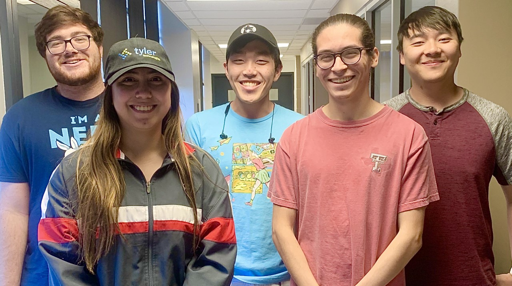

# Project 1 - Group 10: Personal Mirror

### Team members and our roles

From right to left: Timothy Bell, Angela Green, Stanley Yoang, Abraham Esparza, and Jack Chen

Timothy Bell -
Research and use p5.js. Implement the widgets and the functionality of our project.
Found the assets we'll be using. Added items to the Github. Researching external APIs that we want to utilize.

Angela Green - Team Leader.
Update the README file. Keep everyone on task, make sure we're hitting benchmarks. Help where needed.
Keeping everyone updated and distributed the tasks. Making sure everyone has what they need to accomplish their tasks. Researching external APIs that we want to utilize.

Stanley Yoang -
Sketch the ideas that we all come up with. Make sure the UI/UX is where we want it to be.
Implementing the design from the sketches. Making sure it looks how we planned it. Researching external APIs that we want to utilize.

Abraham Esparza -
Sketch the ideas that we all come up with. Make sure the UI/UX is where we want it to be.
Implementing the overlay.

Jack Chen -
Research and use p5.js. Implement the widgets and the functionality of our project.
Implementing the buttons and their functionality.

Everyone will be contributing ideas for the UI and helping to implement them.

### UI Sketch, main functions to be supported:

Current Condition:  
-User has walked in front of mirror and turned it on. The default/user-customized layout displays

Action:  
-User wants to show a more detailed health description of him/herself so he/she taps the health app

New Conditions:  
-More detailed health information is displayed in the larger health widget

Action:  
-User wants to show a more detailed weather forecast so he/she taps the weather widget

New Conditions:  
-More detailed weather information is displayed in the larger weather widget

Action:  
-User wants to show edit size and placement of selected app/widget

New Conditions:  
-Selected app/widget's corners are highlighted with blue squares

Action:  
-User drags bottom left corner outwards to expand the notifications widget  
New Conditions: 
-Notifications widget is expanded
-Nearby apps/widgets are resized automatically accommodate the resized app/widget

Action:  
-User drags notifications widget to trash icon to remove it from the screen

New Conditions:  
-Notifications widget is removed from the screen

### How far did we go with the implementation?

As of right now, we have played around with the sizing and video capture in p5.js along with seeing how to create an overlay on top of the capture. We have not started implementing the features discussed above at this current time. However, our group has a strong idea of how we want out mirror to look including more states that have not been depicted in the sketches above.

### The plan moving forward:

Now that sketches are done and we know what features we want to include in our project, now we will be adding to the p5.js file within this GitHub project. This will allow for collaboration among the group as we will make a separate branch for testing. By using pull requests we will be able to check each other's work and merge when we feel that the improvements are of good quality.
